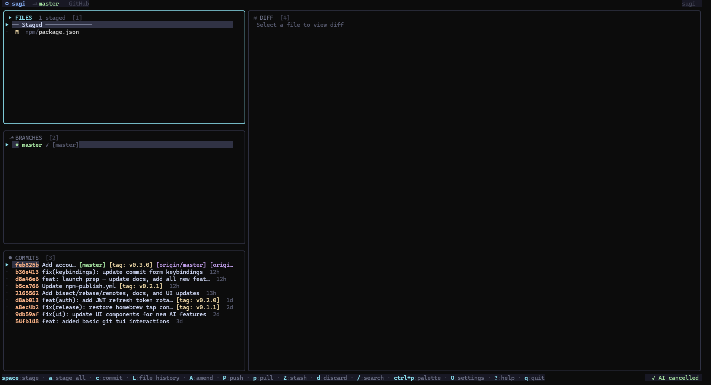

# sugi 杉

> A terminal UI git client — GitHub/GitLab PRs, AI commit messages, interactive rebase, bisect, worktrees, multi-account management, and more.

```
  sugi (杉) — cedar tree. Grows fast, stands tall, shaped with precision.
```

[](https://github.com/Kroszborg/sugi/actions/workflows/ci.yml)
[](https://goreportcard.com/report/github.com/Kroszborg/sugi)
[](LICENSE)

---

## Screenshot



---

## Features

### Core panels
| Panel | Key | What it does |
|-------|-----|--------------|
| **Files** | `1` | Stage/unstage/discard individual files or hunks; multi-select with `ctrl+space` |
| **Branches** | `2` | Checkout, create, rename, delete; merge, rebase, open in browser |
| **Commits** | `3` | Full log with ASCII graph, cherry-pick, revert, reset, interactive rebase, blame, file history |
| **Diff** | `4` | Unified diff, hunk navigation, stage/unstage hunks, AI summary; shows file diff or commit diff based on focus |

### Extra panels (overlays)
| Panel | Key | What it does |
|-------|-----|--------------|
| **Accounts** | `A` | Manage multiple GitHub/GitLab accounts with named tokens |
| **PR / MR** | `P` | GitHub & GitLab pull requests with CI badges, review status |
| **Stash** | `z` | List, apply, pop, drop stashes with diff preview |
| **Blame** | `b` | File blame — author, date, hash per line |
| **Reflog** | `R` (from commits) | Full reflog with undo capability |
| **Worktrees** | `W` | List, add, remove git worktrees |
| **Remotes** | `E` | List, add, remove, rename, fetch remotes |
| **Bisect** | `B` | Interactive git bisect — mark good/bad, view log |
| **Interactive Rebase** | `i` | Reorder/squash/fixup/drop/reword commits visually |
| **Conflict Resolver** | auto | Opens on conflicted files — pick ours/theirs per block |
| **File History** | `L` | Log of commits touching the selected file |
| **Command Palette** | `ctrl+p` | Fuzzy search all actions |
| **Help** | `?` | Scrollable keybinding reference |
| **Settings** | `O` | Edit config in-app, saved instantly |

### AI integration
- **`ctrl+g`** or **`alt+g`** — generate a commit message from staged diff (Groq, free)
- **`A`** (in diff panel) — AI-summarise the current diff
- Uses `llama-3.1-8b-instant` by default (fast, free tier)

### Multi-account management
Switch between personal and work GitHub/GitLab accounts without editing config manually:
- Press `A` to open the Accounts panel
- `tab` to switch between GitHub / GitLab
- `n` to add a new named account (name → token → optional host)
- `enter` to activate an account (shown in status bar as `⬡ account-name`)
- `D` to delete an account

### Performance & reliability
- **Context-aware timeouts**: local git operations time out after 30s, network operations (push/pull/fetch) after 2 minutes
- **Debounced resize**: window resize events are debounced — no flashing, cursor positions preserved
- **Responsive layout**: adapts to narrow (< 100 cols) and very narrow (< 60 cols) terminals; minimum panel height guards prevent overflow

### Git operations
Stage, unstage, discard, commit (with amend), push (with force-with-lease), pull, fetch, merge, rebase, reset (soft/mixed/hard), revert, cherry-pick, create/delete/rename branch, add/delete/push tag, worktree management, bisect, interactive rebase, conflict resolution, remote management.

---

## Install

```sh
# npm (macOS, Linux, Windows)
npm install -g @kroszborg/sugi

# Homebrew (macOS / Linux)
brew install Kroszborg/tap/sugi

# go install
go install github.com/Kroszborg/sugi/cmd/sugi@latest
```

---

## Usage

```sh
sugi              # open in current directory
sugi /path/repo   # open a specific repo
sugi version      # print version
```

---

## Key bindings

### Navigation
| Key | Action |
|-----|--------|
| `tab` / `shift+tab` | cycle panels |
| `1` `2` `3` `4` | jump to Files / Branches / Commits / Diff |
| `↑↓` / `j` `k` | move up/down |
| `pgup` / `pgdn` | page up / down |
| `/` | search / filter |
| `esc` | back / cancel |
| `ctrl+p` / `alt+p` | command palette |
| `?` | help overlay |
| `q` / `ctrl+c` | quit |

### Files panel
| Key | Action |
|-----|--------|
| `space` | stage / unstage selected file |
| `ctrl+space` | multi-select toggle (then `space` to stage all selected) |
| `a` | stage all files |
| `d` | discard changes (with confirmation) |
| `c` | open commit form |
| `ctrl+a` | amend HEAD commit |
| `P` | push |
| `p` | pull |
| `f` | fetch |
| `F` | force push with-lease |
| `L` | file history (commits touching this file) |
| `z` | stash panel |
| `Z` | stash all changes |
| `s` / `S` | toggle staged/unstaged diff view |

### Branches panel
| Key | Action |
|-----|--------|
| `enter` | checkout branch |
| `n` | new branch |
| `R` | rename branch |
| `D` | delete branch (with confirmation) |
| `m` | merge branch into current |
| `r` | rebase current onto branch |
| `o` | open branch on GitHub / GitLab |
| `P` / `p` | push / pull |
| `E` | remotes panel |
| `r` | refresh |

### Commits panel
| Key | Action |
|-----|--------|
| `↑↓` | navigate; diff panel shows commit diff |
| `y` | copy commit hash to clipboard |
| `C` | cherry-pick commit (with confirmation) |
| `v` | revert commit (with confirmation) |
| `X` | reset HEAD to this commit (soft / mixed / hard) |
| `i` | interactive rebase from this commit |
| `o` | open commit on GitHub / GitLab |
| `g` | toggle ASCII commit graph |
| `b` | blame current file at this commit |
| `R` | reflog panel |
| `ctrl+a` | amend HEAD commit |

### Diff panel
| Key | Action |
|-----|--------|
| `↑↓` / `j` `k` | scroll diff |
| `[` / `]` | previous / next hunk |
| `space` | stage hunk |
| `u` | unstage hunk |
| `s` / `S` | toggle staged/unstaged diff |
| `ctrl+i` | AI-summarise diff |

> **Tip:** The diff panel shows the **selected file's diff** when focused on Files or Diff panels, and the **commit diff** when focused on Commits. Tab to panel `4` to switch back to file diff mode.

### Accounts panel
| Key | Action |
|-----|--------|
| `tab` | switch between GitHub and GitLab tab |
| `↑↓` | navigate accounts |
| `enter` | activate account (uses this token for forge operations) |
| `n` | add new account (3-step: name → token → host) |
| `D` | delete account |
| `esc` | close panel |

### Global
| Key | Action |
|-----|--------|
| `c` | commit form |
| `ctrl+g` / `alt+g` | AI-generate commit message |
| `P` | open PRs panel (from main panels) |
| `A` | accounts panel (from any panel) |
| `W` | worktrees panel |
| `B` | bisect panel |
| `E` | remotes panel |
| `O` | settings |

---

## AI setup (Groq — free)

1. Sign up at **[console.groq.com](https://console.groq.com)** (free, no credit card needed)
2. Create an API key
3. Press `O` in sugi to open Settings and paste your key, **or** add to `~/.config/sugi/config.json`:

```json
{
  "groq_api_key": "gsk_..."
}
```

Or set the environment variable:
```sh
export GROQ_API_KEY=gsk_...
```

sugi uses `llama-3.1-8b-instant` by default. To use a larger model:
```json
{ "groq_model": "llama-3.3-70b-versatile" }
```

---

## GitHub / GitLab integration

sugi auto-detects the forge from your `origin` remote URL.

### Single account (simple)

**GitHub:** set `GITHUB_TOKEN`, or sugi reads from the `gh` CLI automatically.

**GitLab:** set `GITLAB_TOKEN`.

Or configure in `~/.config/sugi/config.json`:
```json
{
  "github_token": "ghp_...",
  "gitlab_token": "glpat-...",
  "gitlab_host": "https://gitlab.company.com"
}
```

### Multiple accounts (new)

Use the Accounts panel (`A`) to manage named tokens for personal and work accounts:

1. Press `A` to open Accounts
2. Press `n` to add an account — enter a **name**, **token**, and optionally a **host** (for GitHub Enterprise / self-hosted GitLab)
3. Press `enter` to **activate** an account — sugi uses that token for all forge operations
4. The active account is shown in the status bar as `⬡ account-name`
5. Accounts are saved to config and remembered across sessions

Example config after adding accounts:
```json
{
  "github_accounts": [
    { "name": "personal", "token": "ghp_..." },
    { "name": "work",     "token": "ghp_...", "host": "github.company.com" }
  ],
  "active_github_account": "work"
}
```

---

## Full config reference

`~/.config/sugi/config.json` — all fields optional, auto-created on first run:

```json
{
  "groq_api_key": "",
  "groq_model": "llama-3.1-8b-instant",
  "github_token": "",
  "gitlab_token": "",
  "gitlab_host": "",
  "mouse_enabled": true,
  "show_graph": false,

  "github_accounts": [],
  "gitlab_accounts": [],
  "active_github_account": "",
  "active_gitlab_account": ""
}
```

---

## Build from source

```sh
git clone https://github.com/Kroszborg/sugi
cd sugi
go build -o sugi ./cmd/sugi
./sugi
```

Requires **Go 1.23+**.

---

## Contributing

See [CONTRIBUTING.md](CONTRIBUTING.md). Issues and PRs welcome!

---

## License

[MIT](LICENSE)
